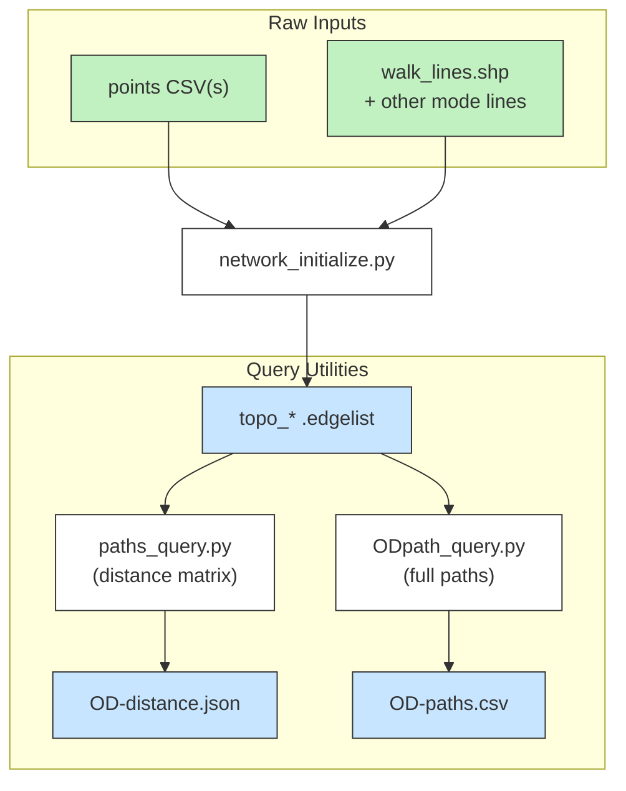
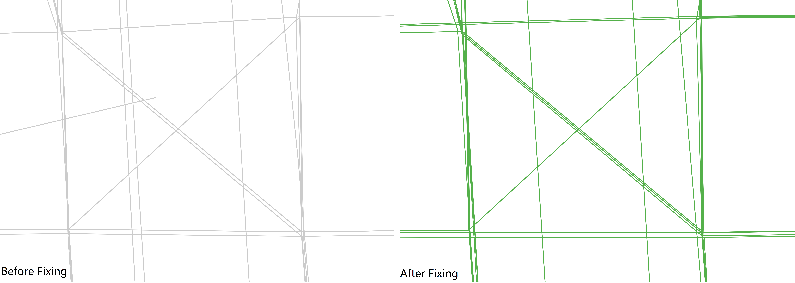
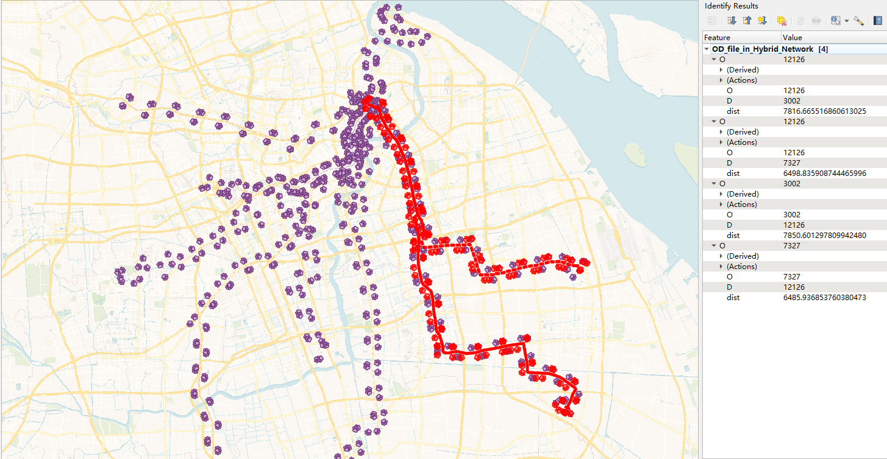
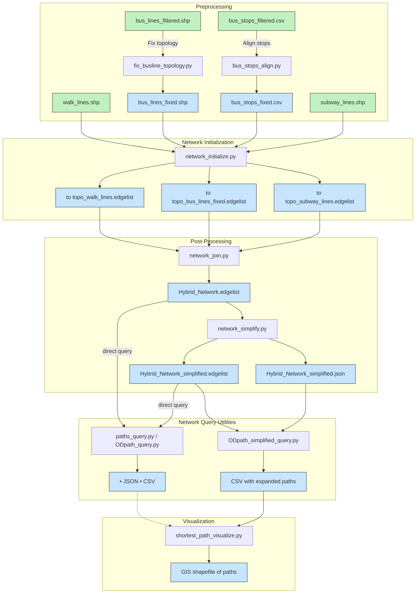

# Transport Network Construct Toolbox -- Basic Workflow



---

# Setup Environment

Before running the toolbox, install the necessary Python packages.  
This project was developed under:

> pandas 2.2.2, geopandas 1.0.1, shapely 2.0.5, networkx 3.3, numpy 1.24.4

To install all required packages at once, use:

```bash
pip install -r requirements.txt
```

This ensures compatibility with the provided scripts across all workflow stages.

---


## Contents

1. [Network Initialization](#1-network-initialization)  
2. [Network Query Utilities](#2-network-query-utilities)  
3. [Pre-processing Utilities](#pre-processing-utilities) 
4. [Post-Processing Utilities](#post-processing-utilities)

---

# Basic Workflow

## 1. Network Initialization

This module initializes the input data for road network construction by loading points and lines, projecting coordinates, and preparing initial topological relationships.

It mainly:
- Loads point datasets from CSV files (e.g., centroids, bus stops, subway stops).
- Loads line datasets from shapefiles (e.g., walkable paths).
- Projects all geometries into a consistent Coordinate Reference System (CRS).
- Constructs preliminary topology by associating points with their nearest lines.
- Generates necessary outputs including decomposed shapefiles and a network edgelist.

### Workflow Steps

1. **Load Point CSV Files**  
   Multiple CSV files are accepted. Each file should contain:
   - A unique ID field.
   - X and Y coordinate fields.
   - The coordinate system specified by EPSG code.
   - These points represent Points of Interest (POIs) — such as centroids, bus stops, or subway entrances — that are not originally part of the line network.

> **Important:**
> These points are explicitly anchored onto the road network during initialization.
> If the set of anchoring points changes later (e.g., adding new bus stops, adjusting POI locations), you must re-run the network initialization to correctly rebuild the network topology and edgelists.

> **ERROR Info & Troubleshooting:**
> - **Error Message**:  
> `"Duplicate IDs found in the combined GeoDataFrame."`
> - **What It Means**:  
> This error indicates that the imported CSV files contain **duplicate values** in the field you've specified as the **unique ID**.
> - **How to Fix It**:  
> Please **ensure that the ID field contains only unique values** across all input CSV files.  
> The responsibility for providing unique identifiers lies with the user.


2. **Load Line Shapefile**  
   A single shapefile is used to load linear features. You can optionally preserve specific attribute fields (e.g., 'Direction') for later use.

3. **Project into Target CRS**  
   All points and lines are transformed into the specified projection CRS (e.g., UTM).

4. **Compute Points' Nearest Lines**  
   Each point is assigned to its nearest line within a given buffer range. This step ensures spatial anchoring.

5. **Construct Topology and Edgelist**  
   Nodes and edges are generated based on the projected relationships between points and lines. Results are saved into shapefiles and edgelist files.

6. **Error Logging**  
   Points that cannot be matched to a line are recorded in an error log (`error_ids.txt`).

### Parameters

| Parameter | Type | Description | Example |
|:----------|:-----|:------------|:--------|
| `pt_csv_param` | list of tuples | List of point CSV input parameters. Each tuple should include `(csv_path, id_field, (x_field, y_field), epsg_code)`. | `[('grid_centroids.csv', 'Id', ('X', 'Y'), 'epsg:32651')]` |
| `line_shp_path` | str | Path to the line shapefile. Only one file is accepted. | `'walk_lines.shp'` |
| `preserve_fields` | list of str | List of field names from the line shapefile to preserve. Optional but recommended for topology (e.g., direction field). | `['Direction']` |
| `direction_field` | str | (Optional) Name of the field describing line directionality. Can be `None`. | `'Direction'` |
| `target_crs` | str | Target Coordinate Reference System (must be a projection CRS like UTM). | `'epsg:32651'` |
| `buffer_range` | float | Buffer distance (in meters) to find nearby lines for each point. | `1500` |
| `merge_tol` | float | Tolerance (in meters) for merging projected points to line endpoints (affects network topology). Smaller values maintain finer structures. | `0.01` |

### Outputs

| Output | Format | Description |
|:-------|:-------|:------------|
| Topological Line Shapefile | `.shp` | Lines updated with inserted nodes and corrected topology. |
| Points Shapefile | `.shp` | Loaded and projected points. |
| Nodes Shapefile | `.shp` | Node points extracted from line features. |
| Projection Points Shapefile | `.shp` | Projected points connecting original points to line geometries. |
| Edgelist File | `.edgelist` | Text file containing `source_node target_node distance` per line. |
| Error IDs File | `.txt` | List of point IDs that failed to match any line. Only generated if unmatched points exist. |

---

- Ensure all coordinate systems are properly defined to avoid projection errors.
- It is recommended to keep the `buffer_range` reasonable based on the network density.
- The script supports multithreaded loading for faster initialization of large datasets.

---

### Example of Output .shp Files Above  


---

## 2. Network Query Utilities

After generating the **topological network** and its `.edgelist` in Section&nbsp;1, you can interrogate the network with two ready-made scripts:

| Script | Purpose | Typical Use-Case |
|--------|---------|------------------|
| `paths_query.py` | Produce a **distance matrix** (shortest-path lengths) between many origins and many destinations, optionally within a cut-off. | Fast accessibility studies, service-area analysis, bulk OD impedance lookup. |
| `ODpath_query.py` | Retrieve the **exact node-by-node path** for each individual OD pair listed in a CSV. | Detailed routing, itinerary export, map matching, simulation inputs. |

---

### 2.1 `paths_query.py` — Batch Distance Matrix

### What it does
1. Loads an **edgelist** (undirected or directed) and an **OD CSV**.  
2. Converts the `O` and `D` columns to unique origin/destination sets.  
3. Computes the shortest-path length from every origin to every destination using **multi-processing**.  
4. Saves a nested-dictionary JSON whose outer keys are origins and inner keys are destinations.

#### Required inputs
| Variable | Type | Description |
|----------|------|-------------|
| `edgelist_file` | `str` | Path to the topological network generated in Section 1 (must contain a `weight` attribute). |
| `od_file` | `str` | CSV with **at least** two columns: `O` (origin node ID) and `D` (destination node ID). The columns are **NOT required** to be of the same length. |
| `has_direction` | `bool` | `True` if edges respect direction; `False` for undirected networks. |
| `cut_off` | `int` | Maximum path cost allowed (same unit as edge weight). Unreachable pairs beyond this value are omitted. |
| `self_dist` | `int/float` | Distance to assign when origin == destination. |
| `cpus` | `int` | Number of worker processes for parallel search. |

> **Tip:** Adjust `cut_off` to limit computation on very large graphs.

#### Output
A JSON named `<OD-csvname>-<cut_off>.json`, e.g. `OD_file-3600.json`.  
Structure (pretty-printed for clarity):

```json
{
  "node_1": {
    "node_99": 845.6,
    "node_150": 1275.4
  },
  "node_2": {
    "node_99": 102.3
  }
}
```

Only pairs within `cut_off` are written; others are omitted.

---

### 2.2 `ODpath_query.py` — Explicit Path Retrieval

#### What it does
1. Loads the same **edgelist** and **OD CSV** (no missing values allowed).  
2. Calculates the **optimal path sequence** for every row in the CSV.  
3. Saves the results back to disk as an augmented CSV.

#### Required inputs
| Variable | Type | Description |
|----------|------|-------------|
| `edgelist_file` | `str` | Path to the network `.edgelist`. |
| `od_file` | `str` | CSV with columns `O` and `D`. Each row represents one OD pair. The columns are **required** to be of the same length. |
| `has_direction` | `bool` | Treat graph as directed (`True`) or undirected (`False`). |
| `cpus` | `int` | Worker processes for concurrent path search. |

#### Output
A CSV named `<od_file>_in_<edgelist_file>.csv`, e.g.  
`OD_file_in_Hybrid_Network.csv`, with (at minimum) the following columns:

| Column | Description |
|--------|-------------|
| `O` | Origin node ID (copied from input). |
| `D` | Destination node ID. |
| `dist` | Total accumulated distance. |
| `path` | Semicolon-separated list of node IDs representing the shortest route. |


> You can open the file in any spreadsheet or import it into GIS software for further visualization.

---

### 2.3 General Notes

* Both scripts rely on helper functions inside `tools.networkX_manipulate`.  
* Large graphs may exhaust RAM if you request dense OD combinations. Use a smaller `cut_off` or split your OD list.  
* Parallelism (`cpus`) should not exceed the physical cores on your machine to avoid overhead.

---

# Pre-processing Utilities

Before constructing the final road network, preprocessing steps are provided to correct raw bus line and bus stop data.  
These scripts ensure that:
- **Bus line topologies** are clean and without overlapping coordinates.
- **Bus stops** are properly **aligned** to the corresponding bus lines.

---

## 1. `fix_busline_topology.py` — Fix Overlapping Vertices in Bus Lines

### What it does
1. Loads a bus lines shapefile.
2. Checks for duplicate or overlapping coordinates within or between line features.
3. Applies a small random "drift" to make each coordinate **topologically unique**.
4. Saves the corrected bus lines into a new shapefile.

### Required inputs
| Parameter | Type | Description |
|:----------|:-----|:------------|
| Input Shapefile | `.shp` | The raw bus line file, expected as `bus_lines_filtered.shp`. |
| Drift distance | `float` | Drift amount to apply for making duplicated points unique (default: `0.1`). |

### Output
| Output | Format | Description |
|:-------|:-------|:------------|
| Fixed Bus Lines | `.shp` | `bus_lines_fixed.shp`, cleaned of duplicate coordinates for safe network building. |

> **Note:** 
> - Drift is random but small, and should not significantly affect geometric integrity.
> - It prints the progress during processing.

---

### Example of the Fixing Procedure Above  


---

## 2. `bus_stops_align.py` — Snap Bus Stops to Bus Lines

### What it does
1. Loads bus stops from a CSV and bus lines from the fixed shapefile.
2. Projects the bus stops into the same CRS as bus lines.
3. For each bus stop, finds the **nearest location along the matching bus line** (based on `Dir_Name` field).
4. Replaces the stop location with the snapped position.
5. Saves the adjusted bus stops as a CSV file.

### Required inputs
| Parameter | Type | Description |
|:----------|:-----|:------------|
| Input CSV | `.csv` | The raw bus stops file, expected as `bus_stops_filtered.csv`. Columns must include `X`, `Y`, and `Dir_Name`. |
| Input Shapefile | `.shp` | The fixed bus line file from previous step: `bus_lines_fixed.shp`. Must contain a `Dir_Name` field. |

### Output
| Output | Format | Description |
|:-------|:-------|:------------|
| Corrected Bus Stops | `.csv` | `bus_stops_fixed.csv`, where stops have been snapped onto their corresponding lines. |

> **Important:**
> - The `Dir_Name` field must exist in both bus stops and bus lines for correct matching.
> - Coordinate transformations are automatically handled (assumes bus stops are initially in `EPSG:4326`).

---

## 3. General Notes

* These preprocessing steps are **optional but highly recommended** for noisy bus data.
* Fixed files (`bus_lines_fixed.shp` and `bus_stops_fixed.csv`) can be directly used in Section 1 initialization.
* Minor geometric adjustments are made to facilitate clean network topology later.

---

# Post-Processing Utilities

Once the hybrid network is built (Section&nbsp;1 in Basic Workflow), you can enrich, simplify, and visualise the results with the following scripts.

| Script | Purpose | Typical Use-Case |
|--------|---------|------------------|
| `network_join.py` | **Merge** walking, bus, subway—and their transfer edges—into a single weighted network. | Multi-modal accessibility studies. |
| `network_simplify.py` | **Collapse** pseudo-nodes and straighten chains of degree-2 nodes to produce a leaner graph. | Faster routing or visual clarity. |
| `ODpath_simplified_query.py` | Query OD paths **after** simplification and **expand** merged edges back to full node sequences. | Detailed itineraries without losing speed gains. |
| `shortest_path_visualize.py` | Convert CSV paths to **LineString geometries** for GIS visualisation. | Map making, further spatial analysis. |

---

## 1. `network_join.py` — Assemble a Hybrid, Time-Weighted Network

`network_join.py` fuses the individual mode networks (walk, bus, subway) into **one routable graph** whose edge weights represent *travel time* (length / speed + wait penalty).

### Processing Pipeline

| # | Stage | Key Helper | Result |
|---|-------|-----------|--------|
| 1 | **Load** mode‐specific edgelists and stop tables | `pd_edgelist`, `pd.read_csv` | Pandas DataFrames in memory |
| 2 | **Convert length → time** using mode speeds | `pd_avg_weight` | Edge weights become seconds |
| 3 | **Add wait/transfer penalties** at stop nodes | `pd_intersect_reassign` | Boarding cost embedded |
| 4 | **Concatenate** all edges | `pd.concat` | One master DataFrame |
| 5 | **Save** to disk | `save_edgelist` | `Hybrid_Network.edgelist` |

### Mandatory Inputs

| File | Purpose |
|------|---------|
| `topo_walk_lines.edgelist` | Pedestrian network from Section 1 |
| `topo_bus_lines_fixed.edgelist` | Bus network (after topology fix) |
| `topo_subway_lines.edgelist` | Subway track network |
| `subway_stop_trans.edgelist` | In-station transfer connectors |
| `subway_stops.csv` (`Sub_Id`) | Subway stop IDs for wait assignment |
| `bus_stops_fixed.csv` (`Bus_Id`) | Bus stop IDs for wait assignment |

*(Change the paths at the top of the script if your filenames differ.)*

### Tunable Parameters

| Variable | Meaning | Default | Typical Range |
|----------|---------|---------|---------------|
| `walk_speed` | Walking speed (m s⁻¹) | **1.11** (=4 km h⁻¹) | 0.8 – 1.5 |
| `bus_speed`  | In-vehicle bus speed | **8.33** (=30 km h⁻¹) | 6 – 12 |
| `sub_speed`  | In-vehicle subway speed | **11.11** (=40 km h⁻¹) | 10 – 20 |
| `bus_wait_time` | Boarding penalty at each bus stop (s) | **300** | 60 – 600 |
| `sub_wait_time` | Boarding penalty at each subway stop (s) | **300** | 120 – 600 |
| `joined_name` | Output filename | `Hybrid_Network.edgelist` | Any |

> **Note** Speeds are specified in km h⁻¹ in comments but converted to m s⁻¹ in code  
> (`xx * 1e3 / 3600`).  If your edge weights are *already* time in seconds, set the speeds to `1`.

### Output

`Hybrid_Network.edgelist` – plain-text table

```
src_node   dst_node   weight  (seconds)
A          B          42.7
…
```

Ready for:

* **`network_simplify.py`** (topological collapsing)  
* **`paths_query.py` / `ODpath_query.py`** (routing)  

---

## 2. `network_simplify.py` — Topological Simplification

`network_simplify.py` reduces the complexity of a graph by removing unnecessary intermediate nodes (typically degree-2 nodes), while preserving connectivity and cumulative travel cost.

### Processing Pipeline

| # | Stage | Key Helper | Result |
|---|-------|------------|--------|
| 1 | **Load** full network edgelist | `open_edgelist` | Directed multigraph loaded |
| 2 | **Identify** simplifiable chains | `_get_paths_to_simplify` | List of node sequences |
| 3 | **Merge** intermediate nodes and sum weights | `simplify_graph` | Leaner graph |
| 4 | **Save** outputs | `nx.write_weighted_edgelist`, `json.dump` | Simplified edgelist + node-merge map |

### Mandatory Inputs

| File | Purpose |
|------|---------|
| `Hybrid_Network.edgelist` | Full network before simplification |

*(Filename can be modified by changing the `edgelist_file` variable.)*

### Output Files

| File | Format | Description |
|------|--------|-------------|
| `Hybrid_Network_simplified.edgelist` | `.edgelist` | Simplified network with consolidated edges |
| `Hybrid_Network_simplified.json` | `.json` | Mapping dictionary of merged paths per edge |

Example of JSON structure:

```json
{
  "W_71535W_71534": "W_71535,W_17313,W_71534",
  "W_72970W_71546": "W_72970,W_71546"
}
```

Each key-value pair indicates how one collapsed edge covers multiple original nodes.

### Key Behavior

| Feature | Description |
|---------|-------------|
| Degree-2 node removal | Chains between endpoints are merged into single edges. |
| Weight preservation | By default, edge `weight` is **summed** over the merged segments. |
| Ring removal | Small isolated loops without intersections can optionally be deleted. |

### Tunable Parameters (Advanced)

These are **only modified inside the script**, if needed:

| Parameter | Meaning | Default |
|-----------|---------|---------|
| `remove_rings` | Remove trivial chordless cycles | `True` |
| `edge_attr_aggs` | How to aggregate attributes across merged edges | `{ "weight": sum }` |

> **Tip:**  
> Always use the simplified `.edgelist` for faster queries if your application does not require preserving every small geometric detail.

---

## 3. `ODpath_simplified_query.py` — OD Path Query with Edge Expansion

`ODpath_simplified_query.py` retrieves shortest paths based on the **simplified network**, then **recovers the full detailed node sequences** by expanding merged edges using a pre-built dictionary.

### Processing Pipeline

| # | Stage | Key Helper | Result |
|---|-------|------------|--------|
| 1 | **Load** simplified network and merge map | `open_edgelist`, `json.load` | Graph and mapping ready |
| 2 | **Read** OD pairs | `pd_od_readin` | Origin–destination DataFrame |
| 3 | **Compute** shortest paths (on simplified edges) | `shortest_path` | Fast preliminary results |
| 4 | **Expand** merged edges into full node sequences | In-script recovery | Restored fine-grained paths |
| 5 | **Save** results | `save_paths` | Augmented CSV |

### Mandatory Inputs

| File | Purpose |
|------|---------|
| `Hybrid_Network_simplified.edgelist` | Simplified network for routing |
| `Hybrid_Network_simplified.json` | Merge mapping from collapsed edges |
| `OD_file.csv` | OD pair table with `O`, `D` columns |

*(Paths are set at the top of the script.)*

### Output Files

| File | Format | Description |
|------|--------|-------------|
| `OD_file_in_Hybrid_Network_simplified.csv` | `.csv` | Expanded paths with full node details |

### Output Columns

| Column | Meaning |
|--------|---------|
| `O` | Origin node ID |
| `D` | Destination node ID |
| `dist` | Total accumulated travel cost (seconds) |
| `path` | Full node sequence after edge expansion |

Example of a `path` field:

```
['12126', 'W148636-12126', 'W_71535', 'W_17313', ..., '12125']
```

Paths are automatically deduplicated while preserving correct traversal order.

### Adjustable Parameters

| Variable | Description | Default |
|----------|-------------|---------|
| `cpus` | Number of parallel worker processes | `8` |
| `has_direction` | Treat network as directed (True) or undirected (False) | `True` |
| File paths | Input/output filenames | Script-top editing |

> **Tip:**  
> If you change the simplification process, **you must regenerate** both the simplified `.edgelist` and the `.json` before running this query script.

---

## 4. `shortest_path_visualize.py` — Generate Path Geometries for Mapping

`shortest_path_visualize.py` converts the OD path results (node sequences) into **spatial LineString geometries**, suitable for GIS visualization and further spatial analysis.

### Processing Pipeline

| # | Stage | Key Helper | Result |
|---|-------|------------|--------|
| 1 | **Load** point shapefiles | `read_shapefiles_parallel` | Combined lookup GeoDataFrame |
| 2 | **Read** OD paths CSV | `pd.read_csv` | Table with paths as node sequences |
| 3 | **Construct** LineStrings | `create_geometry` | Geometries reconstructed in parallel |
| 4 | **Save** output | `GeoDataFrame.to_file` | Shapefile for GIS software |

### Required Inputs

| File | Purpose |
|------|---------|
| Multiple node-related shapefiles | Point coordinates needed to reconstruct paths |
| OD path CSV | The query output containing `path` field |

- **Point Shapefiles**: Must include all possible node IDs referred to in the path CSV.  
  Format: list of tuples `(shapefile path, id_field name)`.

- **Path CSV**:  
  - Must include columns: `O`, `D`, `dist`, and `path` (where `path` is a list of node IDs).
  - Generated from either `ODpath_query.py` or `ODpath_simplified_query.py`.

### Required Manual Edits Before Running

| Setting | What to Edit | Example |
|---------|--------------|---------|
| `pt_gdf` | List of all point shapefiles and their ID columns | `[("walk_lines_pts.shp", "id"), ...]` |
| `od_df_path` | Path to OD result CSV file | `'OD_file_in_Hybrid_Network_simplified.csv'` |

> **Tip:**  
> All node IDs in the `path` list must match the ID fields in the shapefiles.

### Output

| File | Format | Description |
|------|--------|-------------|
| `<OD file name>.shp` | `.shp` | One feature per OD pair, LineString geometry, with attributes: `O`, `D`, `dist` |

The output shapefile will inherit the CRS from the loaded shapefiles.

Example record:

| O | D | dist | geometry |
|---|---|------|----------|
| 12126 | 11994 | 1016.82 | LineString(…) |

> **Note:**  
> Ensure your shapefiles and path CSV are updated and matched properly before running.

---

### Visualization of the Queried Results Above  

> `dist` in seconds for a hybrid network

---

## 5. General Notes

* **Unit consistency** is crucial: all underlying edge weights should be in **meters** (after initialization) or **seconds** (after hybrid joining) after conversion.  
* Regenerate the merge-dictionary (`*.json`) whenever you change or re-simplify the network.  
* Visualisation script assumes **every node ID** appearing in the CSV exists in one of the provided point layers.

---

# Transport Network Construct Toolbox -- FULL Workflow



---

## Author and Attribution

This toolbox was created by **Hammerous** as part of an urban research project at Tongji University.   

---

## References

- Boeing, G. (2024). *Modeling and Analyzing Urban Networks and Amenities with OSMnx*. [View Paper](https://geoffboeing.com/publications/osmnx-paper/)
- Gillies, S., van der Wel, C., Van den Bossche, J., Taves, M. W., Arnott, J., Ward, B. C., et al. (2025). *Shapely (Version 2.1.0) [Computer software]*. [DOI](https://doi.org/10.5281/zenodo.5597138)
- Jordahl, K., Van den Bossche, J., Fleischmann, M., Wasserman, J., McBride, J., Gerard, J., et al. (2020, July 15). *geopandas/geopandas: v0.8.1 (Version v0.8.1)*. Zenodo. [DOI](http://doi.org/10.5281/zenodo.3946761)
